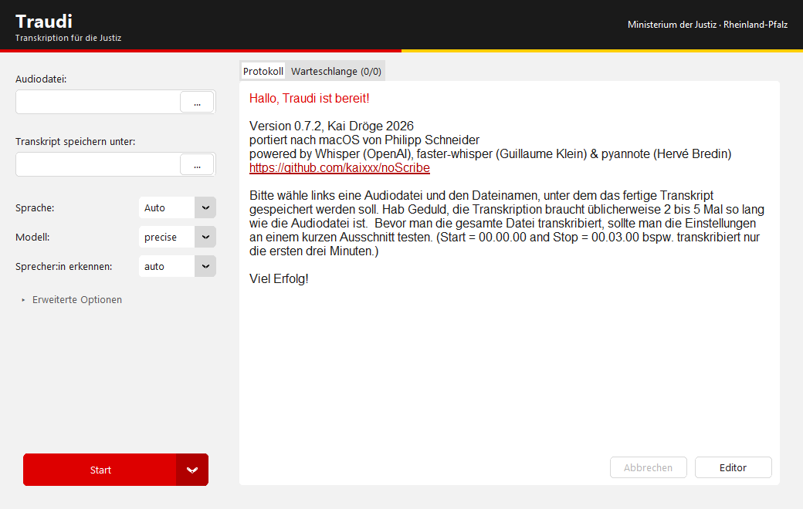
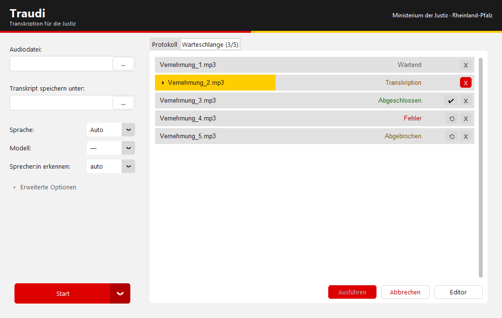
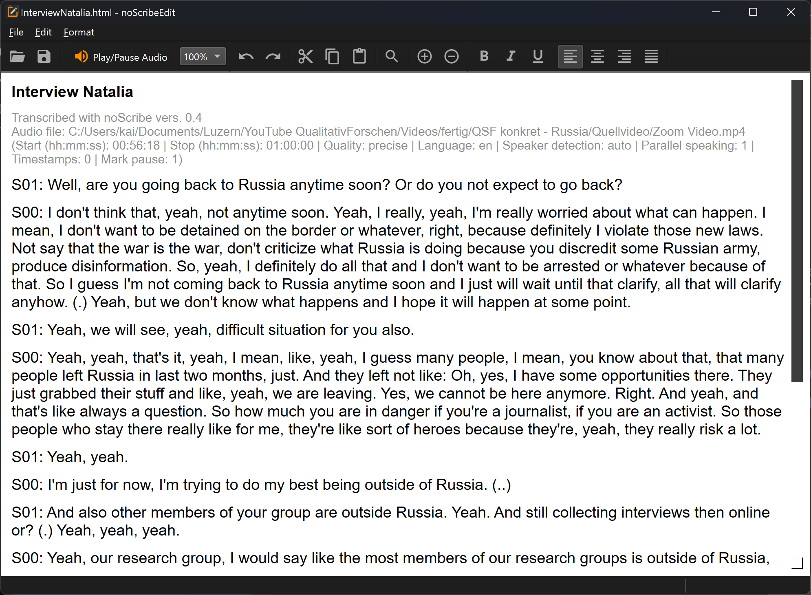

# Traudi

### Transkription für die Justiz Rheinland-Pfalz

Traudi verwandelt Tonaufnahmen automatisch in Text — Vernehmungen, Anhörungen,
Besprechungen. Die Verarbeitung läuft **vollständig auf dem eigenen Rechner**.
Es werden keine Audiodaten übertragen, es wird kein Cloud-Dienst genutzt, und
nach der einmaligen Einrichtung braucht die Anwendung keinen Internetzugang.

Traudi ist eine Abwandlung von [noScribe](https://github.com/kaixxx/noScribe)
von Kai Dröge (GPL-3.0).



---

## Inhalt

- [Installation für Anwenderinnen und Anwender](#installation-für-anwenderinnen-und-anwender)
- [Zentrale Verteilung](#zentrale-verteilung)
- [Installation für Entwicklung](#installation-für-entwicklung)
- [Sprechererkennung einrichten](#sprechererkennung-einrichten)
- [Bedienung](#bedienung)
- [Was die Qualität beeinflusst](#was-die-qualität-beeinflusst)
- [Bekannte Einschränkungen](#bekannte-einschränkungen)
- [Erweiterte Einstellungen](#erweiterte-einstellungen)
- [Installer selbst bauen](#installer-selbst-bauen)
- [Mitwirken](#mitwirken)
- [Herkunft und Lizenz](#herkunft-und-lizenz)

---

## Installation für Anwenderinnen und Anwender

**Nur unter Windows. Sie brauchen weder Python noch Programmierkenntnisse.**

1. Laden Sie die Installationsdatei aus den [Releases](https://github.com/krissi15/noScribe_own/releases) herunter.
2. Führen Sie sie aus. Warnt Windows vor einem „unbekannten Herausgeber", wählen Sie *Weitere Informationen → Trotzdem ausführen*. Die Datei ist nicht signiert.
3. Traudi liegt danach im Startmenü.

**Beim ersten Start** meldet Traudi, dass ein Sprachmodell fehlt, und bietet an,
es herunterzuladen (rund 1,6 GB, einmalig). Der Download dauert je nach
Verbindung einige Minuten. Danach arbeitet die Anwendung offline.

> **Ohne Internetzugang am Arbeitsplatz?** Das Sprachmodell lässt sich auf einem
> anderen Rechner mit `python scripts/fetch_models.py` laden und als Ordner
> kopieren nach
> `%LOCALAPPDATA%\Traudi\Traudi\whisper_models\precise`.

**Für die Verteilung auf viele Rechner** akzeptiert der Installer den Schalter
`/S` für eine unbeaufsichtigte Installation. Einzelheiten für die
Softwareverteilung stehen unter [Zentrale Verteilung](#zentrale-verteilung).

---

## Zentrale Verteilung

Dieser Abschnitt richtet sich an die IT, nicht an Anwenderinnen und Anwender.

Traudi wird **maschinenweit** installiert: nach `%ProgramFiles%\Traudi`, mit
Registrierung unter `HKLM`. Der Installer fordert Administratorrechte
ausdrücklich an (`RequestExecutionLevel admin`). Die Verknüpfungen im Startmenü
und auf dem Desktop werden für **alle** Benutzenden des Rechners angelegt.

### Befehle

| Zweck | Befehl |
|---|---|
| Installieren, unbeaufsichtigt | `Traudi_setup_<version>.exe /S` |
| Zielverzeichnis abweichend | `Traudi_setup_<version>.exe /S /D=C:\Programme\Traudi` |
| Deinstallieren, unbeaufsichtigt | `"%ProgramFiles%\Traudi\uninstall.exe" /S` |

`/D` muss der **letzte** Schalter sein und darf keine Anführungszeichen tragen —
eine Eigenheit von NSIS.

Eine frühere Version wird beim unbeaufsichtigten Lauf automatisch und ohne
Rückfrage entfernt.

### Erkennungsregel

Für Intune, SCCM oder Matrix42 genügt ein Registrierungsschlüssel; ein eigenes
MSI-Paket ist dafür nicht nötig.

```
Schlüssel: HKEY_LOCAL_MACHINE\SOFTWARE\Microsoft\Windows\CurrentVersion\Uninstall\Traudi
Wert:      DisplayVersion
Methode:   Zeichenfolgenvergleich, "ist gleich" <version>
```

Unter demselben Schlüssel stehen außerdem `DisplayName`, `Publisher`,
`EstimatedSize`, `DisplayIcon` sowie `QuietUninstallString` — Letzteres macht
den Rückbau über die Softwareverteilung möglich.

### Was nach der Installation noch fehlt

Die Setup-Datei enthält **kein Sprachmodell**. Ohne eines lässt sich nichts
transkribieren. Beim ersten Start bietet Traudi den Download an (rund 1,6 GB je
Arbeitsplatz).

Wer das nicht über jeden einzelnen Arbeitsplatz laufen lassen will, verteilt das
Modell mit: einmal mit `python scripts/fetch_models.py --only precise` laden und
den Ordner `models/precise` ausrollen nach

```
%LOCALAPPDATA%\Traudi\Traudi\whisper_models\precise
```

Das ist ein **benutzerbezogener** Pfad — die Verteilung muss also im
Benutzerkontext laufen, nicht als System.

### Signatur

Die Installationsdatei ist **nicht signiert**. SmartScreen warnt deshalb vor
einem unbekannten Herausgeber, und AppLocker- oder WDAC-Richtlinien können sie
blockieren. Für einen Rollout in der Fläche wird ein Codesignatur-Zertifikat
gebraucht; dessen Beschaffung hat erfahrungsgemäß Vorlaufzeit und sollte früh
angestoßen werden.

---

## Installation für Entwicklung

**Voraussetzung:** Python 3.12 und Git.
Unter Windows: `winget install Python.Python.3.12 Git.Git`
Unter macOS: `brew install python@3.12 git`

Es braucht **kein** `git-lfs` und **kein** `ffmpeg` — die Audiokonvertierung
läuft über die Python-Bibliothek PyAV.

### Windows

```powershell
git clone https://github.com/krissi15/noScribe_own.git
cd noScribe_own
.\setup.bat
venv\Scripts\activate
python -m noScribe
```

`setup.bat` ruft nur `setup.ps1` auf. Der Umweg ist nötig, weil Windows das
direkte Ausführen von PowerShell-Skripten standardmäßig verbietet
(`ExecutionPolicy: Restricted`). Wer die Richtlinie gelockert hat, kann
`.\setup.ps1` auch direkt aufrufen.

Für NVIDIA-Grafikkarten: `.\setup.bat -Cuda` (CUDA 12.8, Treiber ab 570.65).

### macOS (Apple Silicon) und Linux

```bash
git clone https://github.com/krissi15/noScribe_own.git
cd noScribe_own
./setup.sh
source venv/bin/activate
python -m noScribe
```

Intel-Macs werden nicht unterstützt (Unverträglichkeit mit pyannote 4).

### Was das Setup tut

Es legt eine virtuelle Umgebung unter `venv/` an, installiert die
Abhängigkeiten und lädt über [`scripts/fetch_models.py`](scripts/fetch_models.py)
die beiden Sprachmodelle (zusammen 2,4 GB). Mit `-NoModels` bzw. `--no-models`
bleibt der Download aus.

Das Skript lässt sich auch einzeln aufrufen:

```bash
python scripts/fetch_models.py                 # beide Modelle
python scripts/fetch_models.py --only precise  # nur das genaue Modell
python scripts/fetch_models.py --force         # erneut laden
```

---

## Sprechererkennung einrichten

Die Sprechererkennung („Wer hat wann gesprochen?") nutzt
[pyannote community-1](https://huggingface.co/pyannote/speaker-diarization-community-1).
Dessen Gewichte liegen in einem **zugangsbeschränkten Repository**.

**Anwenderinnen und Anwender brauchen hier nichts zu tun** — der Installer
bringt diese Dateien mit (32 MB).

**Für die Entwicklung** sind drei Schritte nötig:

1. Auf der [Modellseite](https://huggingface.co/pyannote/speaker-diarization-community-1) einmalig die Nutzungsbedingungen bestätigen.
2. Ein Zugriffstoken unter [huggingface.co/settings/tokens](https://huggingface.co/settings/tokens) erzeugen.
3. Die Gewichte laden:

```powershell
$env:HF_TOKEN = "hf_..."
venv\Scripts\python.exe scripts\fetch_models.py --skip-whisper --pyannote
```

```bash
export HF_TOKEN=hf_...
venv/bin/python scripts/fetch_models.py --skip-whisper --pyannote
```

Fehlen die Gewichte, läuft die Transkription weiter; nur die Sprechererkennung
bricht mit einem Hinweis auf genau diesen Befehl ab.

Dasselbe Token muss als Repository-Secret `HF_TOKEN` hinterlegt sein, damit der
[CI-Workflow](.github/workflows/build-windows.yml) den Installer bauen kann.

---

## Bedienung

### Immer sichtbar

- **Audiodatei** — nahezu jedes Audio- und Videoformat. Mehrere Dateien auf einmal landen in der Warteschlange.
- **Transkript speichern unter** — `.html` (Vorgabe, auch vom Editor lesbar), `.vtt` (Untertitel, z. B. für [EXMARaLDA](https://exmaralda.org/)) oder `.txt`.
- **Sprache** — „Auto" erkennt sie selbst, „Multilingual" für gemischte Aufnahmen (experimentell).
- **Modell** — `precise` ist die Empfehlung. `fast` ist auf schwachen Rechnern rund 30 % schneller, verlangt aber mehr Nacharbeit.
- **Sprecher:in erkennen** — „auto" schätzt die Anzahl. Ist sie bekannt, verbessert die feste Angabe das Ergebnis deutlich. „none" schaltet die Erkennung ab und spart viel Zeit.

### Hinter „Erweiterte Optionen"

- **Start / Stopp** (hh:mm:ss) — begrenzt die Transkription auf einen Ausschnitt. **Testen Sie Ihre Einstellungen erst an drei Minuten**, bevor Sie eine Stunde transkribieren.
- **Pausen markieren** — Sprechpausen ab 1, 2 oder 3 Sekunden erscheinen als `(...)`.
- **Überlappende Sprache** — markiert Stellen, an denen mehrere gleichzeitig sprechen.
- **Füllworte** — behält „ähm", „also" usw. Für wörtliche Protokolle sinnvoll.
- **Zeitmarken** — fügt regelmäßig `[hh:mm:ss]` ein.

Der Aufklapp-Zustand wird gemerkt.

### Warteschlange

Mehrere Aufträge lassen sich sammeln und nacheinander abarbeiten. Über das
Aufklappmenü neben *Start* wählen Sie zwischen „sofort starten" und „in die
Warteschlange".



### Editor

Der Knopf *Editor* öffnet `noScribeEdit`, ein separates Programm zum Prüfen und
Korrigieren des Transkripts. Es liegt in einem eigenen Repository und ist
optional:

```bash
git clone https://github.com/kaixxx/noScribeEditor.git noScribeEdit
venv/bin/python -m pip install -r noScribeEdit/environments/requirements.txt
```



### Kommandozeile

```bash
python -m noScribe aufnahme.mp3 protokoll.html --no-gui \
    --language German --model precise --speaker-detection 2
```

`python -m noScribe --help` zeigt alle Schalter, `--help-models` die
installierten Modelle.

---

## Was die Qualität beeinflusst

**Die Tonqualität ist der wichtigste Faktor.** Ein separates Mikrofon für jede
sprechende Person, wenig Hall, wenig Hintergrundgeräusch. Aufnahmen aus
Videokonferenzen sind meist gut, Handyaufnahmen quer über einen Tisch selten.

Eine Stunde Audio braucht auf einer CPU je nach Rechner **zwei bis fünf
Stunden**. Mit NVIDIA-Grafikkarte ist es ein Vielfaches schneller.

Wird die Anzahl der sprechenden Personen fest angegeben statt „auto", wird die
Zuordnung deutlich zuverlässiger.

---

## Bekannte Einschränkungen

**Keine automatische Transkription ist fehlerfrei.** Jedes Transkript braucht
eine Durchsicht. Für ein Protokoll mit Beweiswert ist das keine Kür.

Sehr lange Dateien können dazu führen, dass sich das Modell in Wiederholungen
verfängt. Teilen Sie die Aufnahme über *Start* und *Stopp* in Abschnitte.

Bei sehr leisen oder verrauschten Passagen erfindet das Modell gelegentlich
Text („Halluzination"). Solche Stellen fallen im Editor auf, weil sie inhaltlich
nicht passen.

Meldet Traudi `Transcription worker exited unexpectedly (code 3221226505)`,
erzwingen Sie die CPU: `force_whisper_cpu: 'True'` in der Konfiguration
(siehe unten). Das ist langsamer, aber zuverlässiger.

---

## Erweiterte Einstellungen

Es gibt derzeit **keinen Einstellungsdialog**. Die Feineinstellungen stehen in

```
%LOCALAPPDATA%\Traudi\Traudi\config.yml          (Windows)
~/.config/Traudi/config.yml                       (Linux)
~/Library/Application Support/Traudi/config.yml   (macOS)
```

Die Datei entsteht beim ersten Start. Interessante Schlüssel:

| Schlüssel | Bedeutung |
|---|---|
| `force_whisper_cpu`, `force_pyannote_cpu` | Grafikkarte umgehen |
| `threads` | Anzahl der Prozessorkerne |
| `whisper_compute_type` | Rechengenauigkeit (`default`, `int8`, `float16`) |
| `timestamp_interval`, `timestamp_color` | Aussehen der Zeitmarken |
| `voice_activity_detection_threshold` | Empfindlichkeit der Sprachaktivitätserkennung |
| `check_for_update` | Update-Prüfung beim Start abschalten |

Eigene Whisper-Modelle können nach
`%LOCALAPPDATA%\Traudi\Traudi\whisper_models\<name>` gelegt werden und
erscheinen dann im Modell-Menü.

---

## Installer selbst bauen

```powershell
choco install nsis           # einmalig, als Administrator
.\setup.bat                  # falls noch nicht geschehen
venv\Scripts\activate
python pyinstaller\win_build.py            # CPU
python pyinstaller\win_build.py --cuda     # CUDA
python pyinstaller\win_build.py --skip-nsis  # nur den dist-Ordner
```

Das Ergebnis liegt unter `pyinstaller/win_installer/`. Der Installer enthält
**keine** Whisper-Gewichte — die lädt Traudi beim ersten Start. Das entpackte
Programmverzeichnis bleibt damit bei rund 800 MB statt über 4 GB.

Der Workflow [`build-windows.yml`](.github/workflows/build-windows.yml) macht
dasselbe in GitHub Actions und hängt das Ergebnis an ein Release, sobald ein
Tag der Form `v*` gepusht wird.

---

## Mitwirken

Fehlerberichte und Vorschläge über die
[Issues](https://github.com/krissi15/noScribe_own/issues).

**Übersetzungen** liegen unter [`trans/`](trans/), eine YAML-Datei je Sprache.
Neue Schlüssel müssen in **allen neun** Dateien stehen, sonst zeigt die
Oberfläche den Schlüsselnamen an. Deutsch ist die Leitsprache.

**Farben** stehen zentral in [`noScribe/theme/`](noScribe/theme/): die
CustomTkinter-Theme-Datei `rlp_justiz.json` für alles, was das Framework selbst
zeichnet, und `COLORS` in `__init__.py` für Leinwand, Text-Markierungen und
Kurzinfos. Bitte keine Farben direkt in `main.py` schreiben.

---

## Herkunft und Lizenz

Traudi ist ein Fork von [noScribe](https://github.com/kaixxx/noScribe) von
**Kai Dröge** (Hochschule Luzern / Institut für Sozialforschung Frankfurt),
portiert nach macOS von **Philipp Schneider**, nach Linux von **Eckhard Kadasch**
und **Florian Dobener**.

Die Anwendung steht auf den Schultern von
[Whisper](https://github.com/openai/whisper) (OpenAI),
[faster-whisper](https://github.com/SYSTRAN/faster-whisper) (Guillaume Klein) und
[pyannote.audio](https://github.com/pyannote/pyannote-audio) (Hervé Bredin).

Lizenz: **GPL-3.0**, siehe [LICENSE.txt](LICENSE.txt). Wer Traudi weitergibt,
muss den Quellcode und diesen Hinweis mitgeben.

### Zum Landeswappen

Das Wappen von Rheinland-Pfalz ist ein Hoheitszeichen. Seine Verwendung durch
Stellen außerhalb der Landesverwaltung ist nach dem Landesgesetz über die
Hoheitszeichen genehmigungspflichtig. Traudi verwendet deshalb **nur die Farben**
des Wappens (Schwarz, Rot, Gold, Silber) sowie eine Wortmarke — **kein
Wappenbild**. Läuft die Anwendung offiziell im Auftrag des Ministeriums, kann das
Wappen ergänzt werden; die verbindlichen Vorgaben stehen im Corporate-Design-Portal
des Landes ([cd.rlp.de](https://cd.rlp.de/)).

### Zitieren

Dröge, K. (2025). *noScribe. AI-powered Audio Transcription* [Computer software].
https://github.com/kaixxx/noScribe
